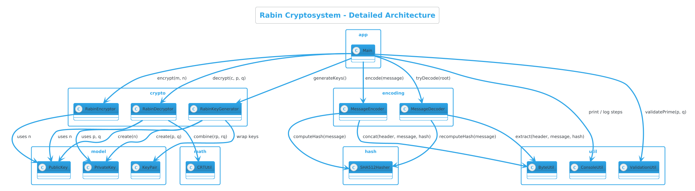
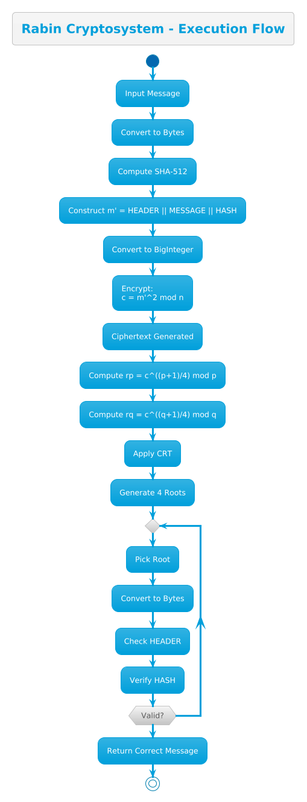
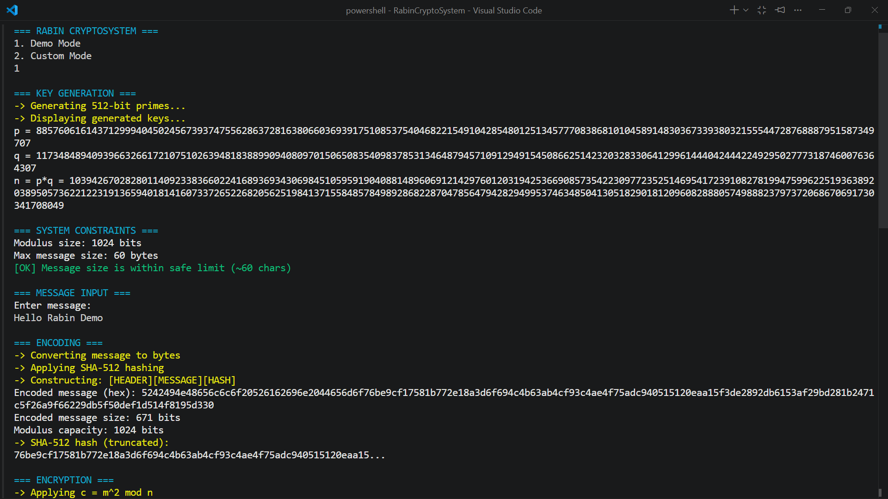
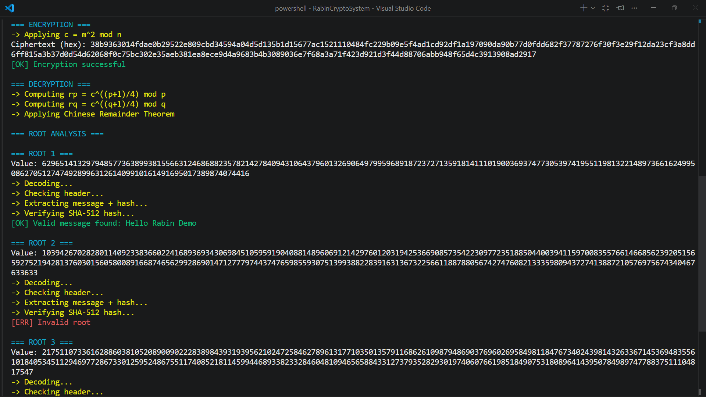
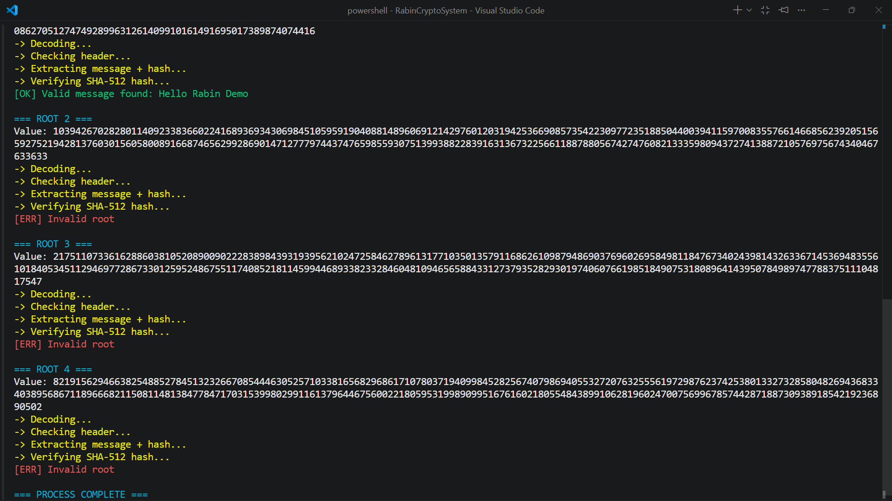
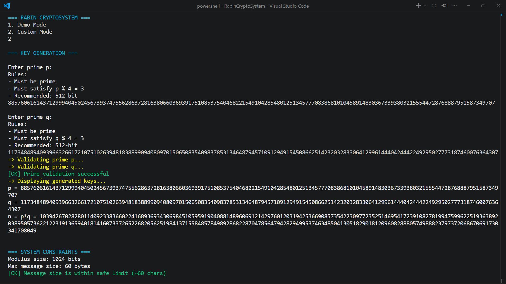
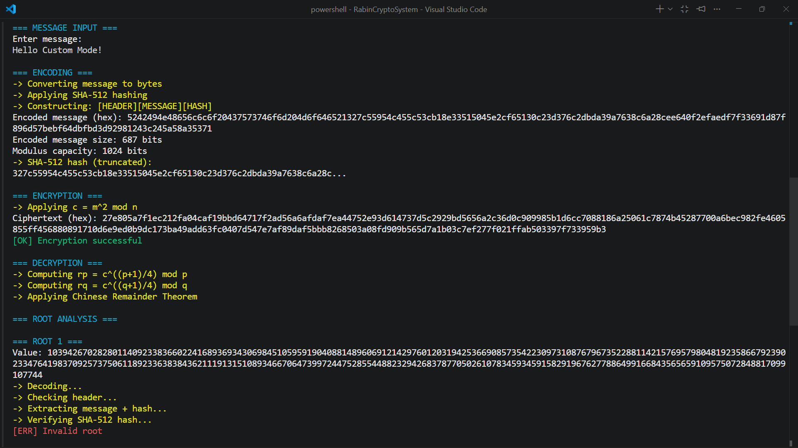
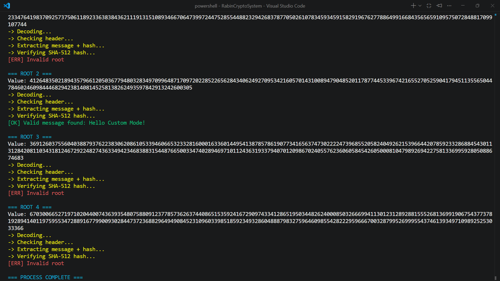
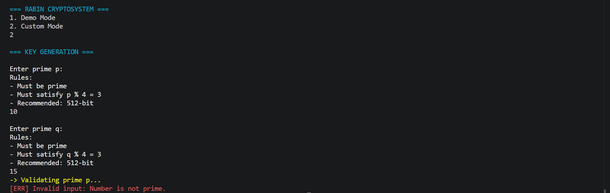
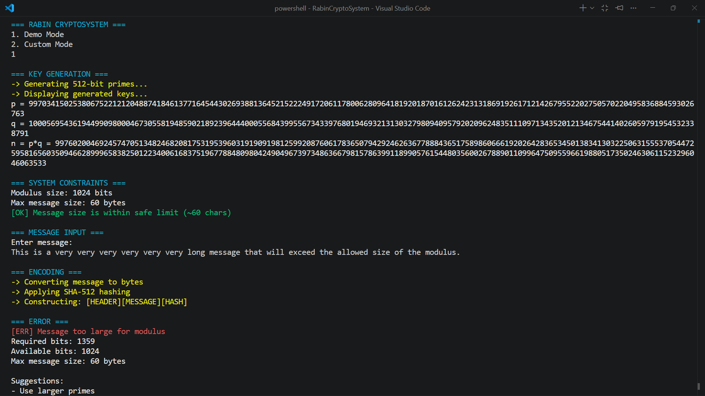

# 🔐 Rabin Cryptosystem in Java

## 📌 Overview

This project is a **complete, modular implementation of the Rabin Cryptosystem** in Java, designed with a focus on **correctness, clarity, and real-world practices**.

It demonstrates:

* Public-key encryption using Rabin algorithm
* Secure message validation using SHA-512
* Decryption via Chinese Remainder Theorem (CRT)
* Step-by-step CLI visualization of the entire cryptographic pipeline

---

## 🚀 Features

* ✔ Rabin public-key encryption
* ✔ SHA-512 based integrity verification
* ✔ Resolves decryption ambiguity (4-root problem)
* ✔ Demo mode (auto key generation) and Custom mode
* ✔ Modular, industry-standard project structure
* ✔ Detailed execution logs and step-by-step tracing

---

## 🧠 Cryptographic Background

### 🔹 Encryption

$$c = m^2 \mod n$$

Where:

* $m$ = encoded message
* $n = p \cdot q$

---

### 🔹 Decryption

We solve:

$$m^2 \equiv c \mod n$$

Steps:

1. Compute modular square roots:

$$r_p = c^{\frac{p+1}{4}} \mod p$$

$$r_q = c^{\frac{q+1}{4}} \mod q$$

2. Combine using Chinese Remainder Theorem (CRT):

$$x = \left( r_p \cdot q \cdot q^{-1} \bmod p + r_q \cdot p \cdot p^{-1} \bmod q \right) \bmod n$$

3. Obtain **four possible plaintexts**

---

## ⚠️ Decryption Ambiguity

The Rabin cryptosystem produces **4 possible roots** during decryption.

To resolve ambiguity, structured encoding is used:

```
[HEADER][MESSAGE][HASH]
```

* HEADER → `"RBIN"`
* HASH → SHA-512(message)

✔ Only one root will satisfy:

* Correct header
* Matching hash

---

## 🏗️ Project Structure

```
src/
└── rabin/
    ├── app/        → Entry point (Main.java)
    ├── crypto/     → Encryption & decryption logic
    ├── math/       → CRT and number theory
    ├── encoding/   → Message encoding/decoding
    ├── hash/       → SHA-512 implementation
    ├── util/       → Utilities (validation, console, etc.)
    └── model/      → Key classes
```

---

## 🧩 Architecture Diagram

The system follows a clean modular architecture with separation of concerns:



---

## ⚙️ Execution Pipeline

### 🔹 Encryption Flow

```
Input Message (String)
        ↓
Convert to bytes (UTF-8)
        ↓
Compute SHA-512 hash
        ↓
Construct:
    m' = HEADER || MESSAGE || HASH
        ↓
Convert to BigInteger
        ↓
Encrypt:
    c = m'^2 mod n
```

---

### 🔹 Decryption Flow

```
Ciphertext
    ↓
Compute rp and rq
    ↓
Apply CRT
    ↓
Generate 4 roots
    ↓
For each root:
    → Convert to bytes
    → Check HEADER
    → Verify SHA-512 hash
    ↓
Return valid message
```

---

## 🔄 Rabin Cryptosystem Workflow

The complete encryption and decryption process is visualized below:



---

## 📥 Input Modes

### 🔹 Demo Mode

* Automatically generates valid 512-bit primes
* Runs full pipeline

### 🔹 Custom Mode

User inputs:

* Prime $p$
* Prime $q$

Conditions:

$$p \equiv q \equiv 3 \mod 4$$

✔ Must be prime
✔ Must satisfy Rabin condition

---

## 📏 Message Size Constraint

Due to encoding:

* SHA-512 → 64 bytes
* Header → 4 bytes
* Modulus ≈ 1024 bits (128 bytes)

### Maximum message size ≈ **60 bytes**

✔ Supported:

* Short text
* Alphanumeric input

❌ Not supported:

* Large text
* Files

---

## 🖥️ How to Run

### Step 1: Compile

```bash
cd src
javac rabin/app/Main.java
```

---

### Step 2: Run

```bash
java rabin.app.Main
```

---

## 📸 Sample Execution Outputs

This section demonstrates different execution scenarios of the Rabin Cryptosystem, covering **full workflow, validation, and constraint handling**.

---

## 🔹 Demo Mode — Complete Execution Pipeline

This scenario demonstrates the **end-to-end working** of the system using automatically generated 512-bit primes.

It includes:
- Key generation (p, q, n)
- Constraint validation
- Encoding with SHA-512
- Encryption
- Decryption using CRT
- Root validation

### 🧾 Key Generation & Constraints


### 🔐 Encoding & Encryption


### 🔓 Decryption & Root Analysis


---

## 🔹 Custom Mode — Valid Input Execution

This scenario demonstrates **user-controlled execution** where valid primes are provided manually.

It verifies:
- Prime validation
- Correct modulus computation
- Successful encryption & decryption

### 🧾 Input & Validation


### 🔐 Encoding & Encryption


### 🔓 Decryption & Valid Message Recovery


---

## ❌ Invalid Prime Handling

This scenario shows how the system **rejects incorrect inputs**.

- Non-prime values are detected
- Execution is safely terminated
- Clear error message is shown



---

## ❌ Message Size Constraint Handling

This demonstrates enforcement of Rabin’s core constraint:

m < n

If the encoded message exceeds modulus capacity:
- System halts encryption
- Displays required vs available bits
- Suggests corrective actions



---

## 🔍 Key Design Decisions

| Feature        | Choice        |
| -------------- | ------------- |
| Prime Size     | 512-bit       |
| Hash           | SHA-512       |
| Encoding       | Header + Hash |
| Interface      | CLI           |
| Validation     | Header + Hash |
| Error Handling | Exceptions    |

---

## ❗ Common Pitfalls (Handled)

* BigInteger sign issues
* Invalid prime inputs
* Message overflow beyond modulus
* Incorrect root selection
* Encoding inconsistencies

---

## 📚 Learning Outcomes

This project demonstrates:

* Public-key cryptography principles
* Modular arithmetic and CRT
* Cryptographic hashing (SHA-512)
* Secure message validation
* Clean and scalable software design

---

## 🔮 Future Improvements

* Chunk-based encryption for large messages
* GUI-based interface
* Performance optimization
* Hybrid encryption (Rabin + AES)

---

## 👨‍💻 Author

**Yash Chugani**

---

## 📌 Final Note

> The Rabin Cryptosystem is **provably as secure as integer factorization**, but requires structured encoding to resolve decryption ambiguity and ensure practical usability.

---
